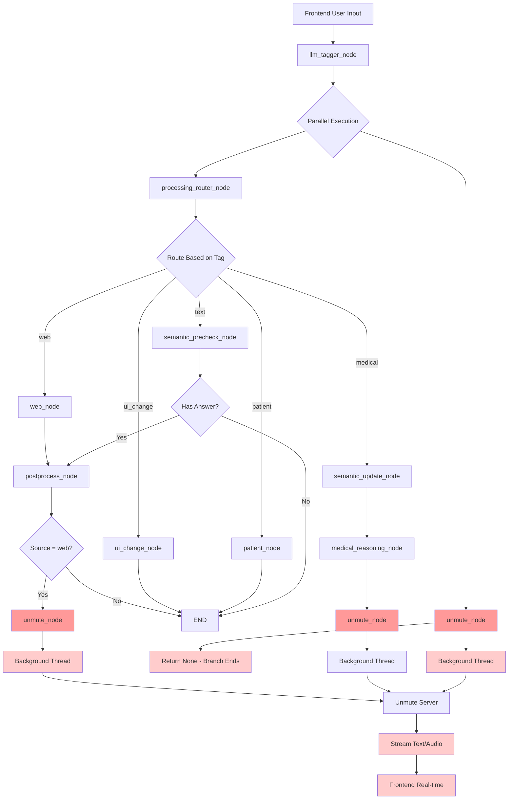

# Parallel Execution Flow Diagram

## LangGraph Parallel Execution Architecture



## Key Features

### 🔄 **Parallel Execution**
- `llm_tagger_node` returns `{'unmute', 'processing_router'}` 
- Both nodes execute simultaneously
- No blocking between branches

### 🎤 **Unmute Side-Effects**
- `unmute_node` starts background thread
- Streams to Unmute server immediately
- Returns `None` to terminate branch
- No impact on main workflow

### ⚡ **Main Workflow Continuation**
- `processing_router` continues normal execution
- Routes to appropriate processing nodes
- Can call `unmute_node` again later if needed

### 🚀 **Multiple Unmute Calls**
- `medical_reasoning_node` → `unmute_node`
- `postprocess_node` (web source) → `unmute_node`
- Each call starts new background thread

## Execution Flow Example

```
1. User: "What's the weather today?"
2. llm_tagger_node: Returns "web" tag
3. Parallel execution starts:
   ├── unmute_node: Starts streaming "WEB" to Unmute
   └── processing_router: Routes to web_node
4. web_node: Performs web search
5. postprocess_node: Processes results
6. postprocess_node: Routes to unmute_node (web source)
7. unmute_node: Starts streaming final answer to Unmute
8. Both branches complete independently
```

## Benefits

- ✅ **Non-blocking**: Unmute streaming doesn't delay main workflow
- ✅ **Real-time**: Frontend receives chunks immediately  
- ✅ **Scalable**: Multiple unmute calls possible
- ✅ **Clean**: Side-effects isolated from main logic
- ✅ **LangGraph Native**: Uses built-in parallel execution 