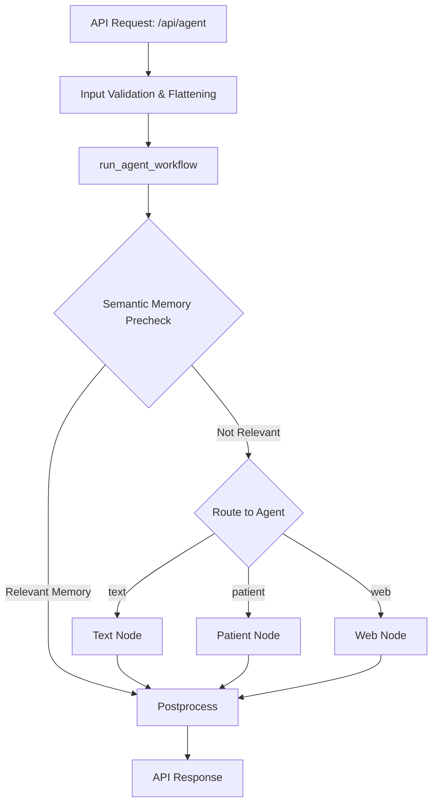

# System Overview

This document provides a high-level summary of the backend system, its flow, the different modules and tools, and the types of requests it can handle. It is based on the code in `api.py`, `main.py`, the `modules/`, and `tools/` directories.

---

## 1. System Flow

### API Layer (`api.py`)
- **Entry Point:** `/api/agent` (POST)
- **Input:** JSON with `prompt` (user input), `memory` (dict), and `patientProfile` (dict)
- **Processing:**
  - Validates and sanitizes input.
  - Flattens patient profile for easier processing.
  - Calls `run_agent_workflow` from `main.py` with user input, memory, and patient profile.
- **Output:**
  - Returns updated patient profile and memory (with defaults filled in if missing).
  - Includes an `extraInfo` field with the final answer or response.

### Main Orchestration (`main.py`)
- **Core Function:** `run_agent_workflow(user_input, memory, patient_profile)`
- **Workflow:**
  1. **Semantic Memory Precheck:**
     - Checks if the input is about the patient profile (using LLM).
     - If not, searches semantic memory for relevant facts.
     - May update semantic memory with new facts/preferences.
  2. **Routing:**
     - Uses LLM to route the request to one of three agents: `text`, `patient`, or `web`.
  3. **Agent Nodes:**
     - **Text Node:** Handles simple conversational responses.
     - **Patient Node:** Handles reading/updating patient profile using LLM and tools.
     - **Web Node:** Handles real-time web search queries.
  4. **Postprocessing:**
     - Uses LLM to generate a final, user-friendly answer based on the tool output and user input.

---

## 2. Modules (`modules/`)

### `memory_operations.py`
- **update_semantic_memory(state):** Adds new facts/preferences to semantic memory.
- **search_semantic_memory(state):** Finds relevant semantic memories using embeddings and cosine similarity.

### `patient_operations.py`
- **read_patient_profile(state):** Returns the current patient profile.
- **update_patient_profile(state):** Uses LLM to update the patient profile JSON based on user instructions, ensuring only relevant fields are changed.

### `text_operations.py`
- **summarize_text(state):** Summarizes text to 3 sentences or less using LLM.
- **extract_keywords(state):** Extracts key terms from text using LLM.
- **respond_conversationally(state):** Generates a conversational reply to user input using LLM.

### `web_operations.py`
- **search_web(state):** Uses Google Programmable Search Engine (PSE) to search the web for up-to-date information.

---

## 3. Tools (`tools/`)

Each tool wraps a module operation and provides a description for LLM-based tool selection.

### `memory_tools.py`
- **update_semantic_memory:** Update semantic memory with new information.
- **search_semantic_memory:** Search semantic memory for relevant facts.

### `patient_tools.py`
- **read_patient_profile:** Retrieve information from the patient profile (e.g., medications, allergies).
- **update_patient_profile:** Update the patient profile based on user instructions.

### `text_tools.py`
- **summarize_text:** Summarize provided text.
- **extract_keywords:** Extract keywords from text.
- **respond_conversationally:** Respond conversationally to user input.

### `web_tools.py`
- **web_search:** Search the web for real-time, factual, or up-to-date information.

---

## 4. Request Types Supported

The system can handle a variety of request types, including but not limited to:

- **Simple Conversation:** Greetings, chit-chat, general questions (handled by the text node).
- **Patient Profile Queries:**
  - "What medications am I taking?"
  - "Do I have any allergies?"
  - "Update my age to 40."
  - "Add yoga to my daily routine."
- **Semantic Memory:**
  - "What did I tell you about my sleep?"
  - "Remember that I prefer tea over coffee."
- **Web Search:**
  - "Current bitcoin value."
  - "Latest news on diabetes research."
  - "Weather in Dubai today."

---

## 5. Data Flow Diagram

---

## 6. Extensibility
- **Adding New Tools:** Implement a new operation in `modules/`, wrap it in a tool in `tools/`, and update the routing logic if needed.
- **LLM Model Choice:** Supports both Groq and Ollama for LLM-based operations, configurable via settings.

---

## 7. Error Handling
- Errors in any node/tool are captured in the state and returned in the API response if encountered.

---

## 8. References
- `api.py`: API entry and response formatting
- `main.py`: Workflow orchestration and routing
- `modules/`: Core business logic for memory, patient, text, and web operations
- `tools/`: Wrappers for tool-based LLM selection and execution 